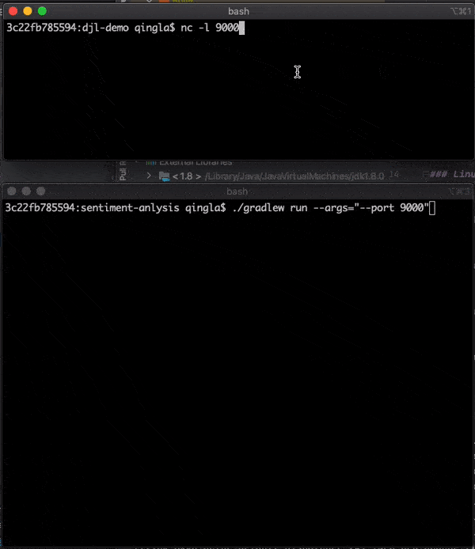

# Sentiment Analysis using Apache Flink



This project runs a Sentiment Analysis application with Apache Flink Stream API.

You can interactively type in sentences to simulate stream data,
and Flink will process and show the result in the terminal.

## Step to run

Firstly you need to create a simple text server by doing the following in the terminal:

### Linux/Mac

```
nc -l 9000
```

### Windows

```
nc -l -p 9000
```

After that you can open another terminal in the project and run the follows:

```
./gradlew run --args="--port 9000"
```

On Windows use `gradlew.bat` instead.

Try to type in anything from your text server:

```
$ nc -l 9000
Hello
```

result shows on Flink application:

```
Loading:     100% |████████████████████████████████████████|
[Flat Map (10/12)] INFO ai.djl.pytorch.engine.PtEngine - Number of inter-op threads is 6
[Flat Map (10/12)] INFO ai.djl.pytorch.engine.PtEngine - Number of intra-op threads is 1
[
        class: "Negative", probability: 0.92125
        class: "Positive", probability: 0.07874
]

```
